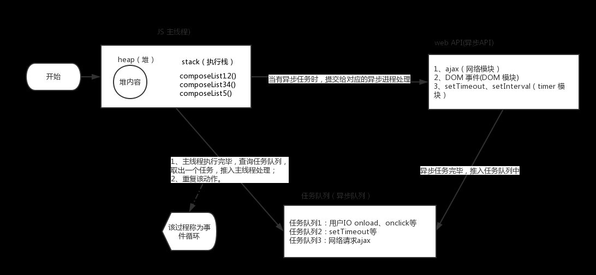
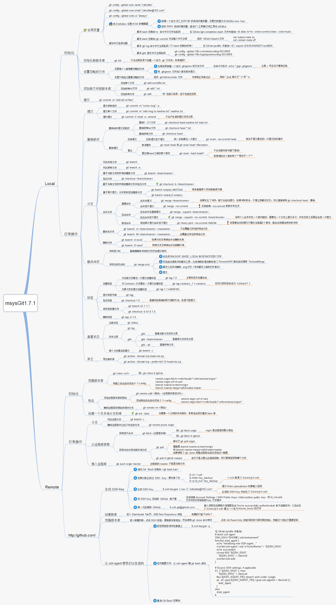

# 优秀的文章汇总

## HTML
  1. [file api](https://www.cnblogs.com/zichi/p/html5-file-api.html)

## css
  1. [css模块](https://75team.com/post/1049.html)

## js
  1. [javascript文档](https://developer.mozilla.org/zh-CN/docs/Web/JavaScript/Reference/Strict_mode)
  2. [ECMAScript](https://tc39.github.io/ecma262/)
  3. [网站性能优化实战—从12.67s到1.06s的故事](https://mp.weixin.qq.com/s/6L_DEtTd8V9yoccpEXf_dA)
  4. [console那些事](http://www.alloyteam.com/2013/11/console-log/#prettyPhoto)
  5. [vue学习笔记](https://github.com/sunseekers/Vue)
  6. [小程序优化](https://blog.csdn.net/i10630226/article/details/81042421)
  7. [node运行原理](https://www.cnblogs.com/peiyu1988/p/8192066.html)
  8. [h5和mpvue示例](https://github.com/F-loat/ithome-lite)[原文：](https://www.jianshu.com/p/2f1b92b4a45f)
  9. [创建js模块](https://m.aliyun.com/jiaocheng/1011478.html)
  10. [promise讲解](https://www.cnblogs.com/lvdabao/p/es6-promise-1.html)
  11. [最简单的vuex应用](https://blog.csdn.net/x550392236/article/details/80668263)
  12. [javascript函数式编程](http://www.cnblogs.com/fengyuqing/p/functional_programming_1.html)
  13. [react入门](http://www.cnblogs.com/nzbin/p/5860219.html)
  14. [Javascript 引擎工作机制详解](https://www.jb51.net/article/98610.htm)
  15. 
  16. 
  17. [图解 React](https://mp.weixin.qq.com/s/DebP97uVxH1dmQr3wTZbjg)
  18. [JavaScript 运行机制详解：再谈Event Loop](http://www.ruanyifeng.com/blog/2014/10/event-loop.html)

## 其他web知识

  1. [视图层架构](https://www.cnblogs.com/coltfoal/p/4713329.html)
  2. [深入理解JavaScript系列](http://www.cnblogs.com/TomXu/archive/2011/12/15/2288411.html)
  3. [GitHub 上的这几个项目或许能帮你学好英语](https://mp.weixin.qq.com/s/9Q1eXxj852Ixbk7JAeKfVA)
  4. [设备像素比devicePixelRatio简单介绍](https://www.zhangxinxu.com/wordpress/2012/08/window-devicepixelratio/)
  5. [Pixi.js使用WebGL，是一个超快的HTML5 2D渲染引擎](https://www.cnblogs.com/afrog/p/4056378.html)
  6. [牛客网-javascript练习](https://www.nowcoder.com/)
  7. [js执行环境和事件循环机制](https://www.cnblogs.com/geek1116/p/10183602.html)
  8. [好孕妈妈石墨文档](https://shimo.im/docs/a3bbcb53b49447e6)
  9. [Web前端学习路线](https://mp.weixin.qq.com/s/X8HfxdvEYeSJI8osaMk1VA)
  10. [window下安装mongodb](https://blog.csdn.net/u010874036/article/details/51921206)
  11. [记录前端的面试日常(持续更新)](https://www.cnblogs.com/fangdongdemao/p/8492563.html?%E5%B0%8F%E7%97%85%E7%8C%AB%E7%9A%84%E5%8D%9A%E5%AE%A2=)
  12. [使用git做服务器端代码的部署](https://www.cnblogs.com/shaohuixia/p/5503521.html)
  13. [git同步发送服务器](https://www.awaimai.com/2203.html)
  14. [clip](http://bennettfeely.com/clippy/)
  15. [一道常被人轻视的前端JS面试题](http://web.jobbole.com/85122/)
  16. [web前端面试题](https://www.zhihu.com/question/41466747?sort=created)
  17. [2014年11月 上 前端资源分享](https://github.com/hacke2/hacke2.github.io/issues/10)
  18. [前端总结](https://github.com/renfanzi/python/blob/fb92fbd083cf0de5d101e9c5500c0996ee9b3bca/README.md)
  19. [前端代码规范 及 最佳实践](https://coderlmn.github.io/code-standards/)
  20. [单页面](https://www.zhihu.com/question/39943474)
  21. [mongodb设置超级管理员](http://www.blogjava.net/liufuxi/archive/2016/12/20/432147.html)
  22. 

## 不关于wen的
  1. [天道评选](https://baijiahao.baidu.com/s?id=1605699808574303449&wfr=spider&for=pc)
  2. [苹果软件下载](http://www.tuyiyi.com/tool-8348-1.html)
  3. [痛点，痒点，建焦点](http://www.360doc.com/content/17/0907/11/11406352_685224008.shtml)
  4. [曾国藩：事不拖，话不多，人不作 (深度好文)](https://mp.weixin.qq.com/s/Gg6rLRguTJUOWuMeCcr-Ng)
  5. [刷爆Facebook的一组漫画：生命太短暂，我没时间讨厌你](https://mp.weixin.qq.com/s/yrWGLcYjxULQRqLBneEPqg)

### 7. 绘制表格

| 项目        | 价格   |  数量  |
| --------   | -----:  | :----:  |
| 计算机     | \$1600 |   5     |
| 手机        |   \$12   |   12   |
| 管线        |    \$1    |  234  |
